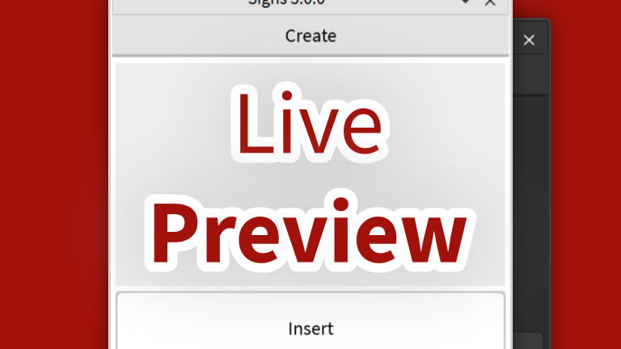

    

&nbsp;

    

---

> Signs is an easy-to-use, intuitive text tool plugin for creating signs, text, and labels.

## Support Signs 💖

**Signs needs your support.** Help support this free and open-source plugin by purchasing [Signs from the Creator Marketplace for 100 Robux](https://create.roblox.com/marketplace/asset/6994955669), the price of $0.24. I'm not forcing you to buy Signs by paywalling features to the Creator Markeplace or bombarding you with notices to pay for Signs in the plugin. I'm just asking if you like Signs and enjoy Signs along with my other projects, please donate less an a quater towards the development Signs.

*If you donate I would like to thank you for supporting my free and open-source software for others to analyze, learn from, and use. I'm make these as a hobby and knowing someone supports my work and loves using it really makes me happy.*

###### [Support us with just the small amount of 24 cents.](https://create.roblox.com/marketplace/asset/6994955669)

## Installation 🧰

[![toolblocks](https://img.shields.io/badge/toolblocks-download-blue?logo=data:image/svg+xml;base64,PD94bWwgdmVyc2lvbj0iMS4wIiBzdGFuZGFsb25lPSJubyI/Pgo8IURPQ1RZUEUgc3ZnIFBVQkxJQyAiLS8vVzNDLy9EVEQgU1ZHIDIwMDEwOTA0Ly9FTiIKICJodHRwOi8vd3d3LnczLm9yZy9UUi8yMDAxL1JFQy1TVkctMjAwMTA5MDQvRFREL3N2ZzEwLmR0ZCI+CjxzdmcgdmVyc2lvbj0iMS4wIiB4bWxucz0iaHR0cDovL3d3dy53My5vcmcvMjAwMC9zdmciCiB3aWR0aD0iMTM0LjAwMDAwMHB0IiBoZWlnaHQ9IjEzNC4wMDAwMDBwdCIgdmlld0JveD0iMCAwIDEzNC4wMDAwMDAgMTM0LjAwMDAwMCIKIHByZXNlcnZlQXNwZWN0UmF0aW89InhNaWRZTWlkIG1lZXQiPgoKPGcgdHJhbnNmb3JtPSJ0cmFuc2xhdGUoMC4wMDAwMDAsMTM0LjAwMDAwMCkgc2NhbGUoMC4xMDAwMDAsLTAuMTAwMDAwKSIKZmlsbD0iI2ZmZmZmZiIgc3Ryb2tlPSJub25lIj4KPHBhdGggZD0iTTEwOSAxMzE3IGMtMjQgLTEzIC01NyAtNDMgLTc0IC02NiBsLTMwIC00MyAtMyAtNTk5IC0yIC01OTkgNjY1IDAKNjY1IDAgMCA1OTAgYzAgNTYxIC0xIDU5MyAtMTkgNjI4IC0yNCA0NyAtNTYgNzcgLTEwMyA5NyAtMzAgMTIgLTc5IDE1IC0yMzgKMTUgbC0yMDAgMCAwIC0zNTYgMCAtMzU2IDQ0IC0zOSBjNzcgLTY4IDEwMCAtMTc5IDU2IC0yNzMgLTIxIC00MyAtNzAgLTk2Ci05MSAtOTYgLTUgMCAtOSA0MiAtOSA5MyBsMCA5MyAtNDkgMzcgYy0yNiAyMCAtNTEgMzcgLTU2IDM3IC00IDAgLTI5IC0xNwotNTYgLTM3IGwtNDggLTM4IC0xIC05MiBjMCAtNTEgLTQgLTkzIC04IC05MyAtMTYgMCAtODEgNzYgLTk3IDExMiAtMzYgODcgLTMKMjA2IDc0IDI2OCBsNDEgMzMgMCAzNTQgMCAzNTMgLTIwOCAwIGMtMTk5IDAgLTIxMSAtMSAtMjUzIC0yM3oiLz4KPC9nPgo8L3N2Zz4K)](https://create.roblox.com/marketplace/asset/13085904556)

Signs is available on the **Creator Marketplace for 100 Robux** or from **GitHub for free**. Signs Free is available on the **Creator Marketplace for free**.

### Creator Marketplace (Recommended)

Installing from the [**Creator Marketplace**](https://create.roblox.com/docs/production/publishing/creator-marketplace) is recommended to install **Signs** or **Signs Free** and allows for **automatic updates** from Roblox and **easier installation**.

To install from the **Creator Marketplace**, click the below link for the plugin version you want to install. Once at the page, click <kbd>**Get Plugin**</kbd    > to install the plugin into **Roblox Studio**.

- [**Signs** (100 Robux)](https://create.roblox.com/marketplace/asset/6994955669)

- [**Signs Free** (Free)](https://create.roblox.com/marketplace/asset/13085904556)

### GitHub

Installing from [**GitHub**](https://github.com/about) allows you to access the full paid version of Signs for free but **no automatic updates** due to limitations and a slightly more complex installation.

To install from **GitHub**, first, download the latest `.rbxm` plugin file of Signs from the below link. Once you have the file, go to `%localappdata%\Roblox\Plugins` and insert `Signs.rbxm` into that folder.

- [**Signs**](https://github.com/RyanLua/Signs/releases)

### ToolBlocks

Installing from [**ToolBlocks**](https://toolblocks.gg/) allows you to access the full paid version of Signs for free but **no automatic updates** due to limitations and a slightly more complex installation.

To install from **ToolBlocks**, first, download the latest `Signs.zip` file and extract to get the `Signs.rbxmx` file inside. Download from the below link. Once you have the file, go to `%localappdata%\Roblox\Plugins` and insert `Signs.rbxm` into that folder.

- [**Signs**](https://toolblocks.gg/a/signs.5OcnvIkyvqpA3sdJoI6F)

## Features ⭐

Signs offers **many features and benefits**. Not just over other plugins but TextLabels itself. Such features include:

### Open-Sourced

Signs is **open source and free**. Change and modify the plugin to meet what you want. Look out for some bugs and fix them, and we might even add your code to the official plugin. You should know what you're installing and running on your computer.
 
 
 
 
 

### High Customization

Edit the outline of your text, the background, and even the sign itself. Change the colors of each of these properties along with transparency. Manipulate how light interacts with your sign and if it is always rendered on top.
 
 
 
 
 

### UI Stroke

Change the stroke of the font in customize in ways that the text stroke property can't. Edit the outline join and thickness as well as normal text stroke properties like color and transparency.
 
 
 
 
 

### Automatic Dark & Light Themes

The plugin's theme will automatically update when using Signs to match Roblox Studio's. No restarting of Roblox Studio or Signs is needed due to Signs being able to detect and change its theme when Roblox Studio's theme changes.
 
 
 
 
 

### Live Preview

Edit signs and view changes in a preview showing exactly how your sign will look. Each and every change you make in the editor is updated to the preview. View signs before they are inserted.
 
 
 
 
 

### Features List

Below is a list of features that are available in Signs and Signs Free. The list is split into two tables, one for Signs and one for Signs Free.

| Feature | Signs Free | Signs
| :--- | :---: | :---: |
| Live Preview | ☑️ | ☑️ |
| Automatic Dark & Light Themes | ☑️ | ☑️ |
| Text Size, Color, Transparency, Rotation | ☑️ | ☑️ |
| Text Wrapped & Scaling | ☑️ | ☑️ |
| Line Height |  ☑️ | ☑️ |
| Bold & Italic Typefaces | ☑️ | ☑️ |
| Background Color, Transparency | ☑️ | ☑️ |
| Size & Aspect Ratio | ☑️ | ☑️ |
| Horizontal & Vertical Alignment | ☑️ | ☑️ |
| Character Limit | 1024 <small>(1 KiB)</small> | 16384 <small>(6 KiB)</small> |
| Font Faces | 36 | 117 |
| Stroke Color, Transparency, Thickness, Join1 | Basic | All |
| Always On Top | 🔲 | ☑️ |
| Light Influence | 🔲 | ☑️ |
| Auto Localize2 | 🔲 | ☑️ |
| Beta Updates3 | 🔲 | ☑️ |

<small>

1 Stroke customization is limited to only Color and Transparency for Basic.
2 Autolocalized is enabled by default and can't be disabled through the editor.
3 Early access to experiential updates. Signs Free version will still recieve updates.

</small>

## Frequently Asked Questions 🤔

Wasn't Signs formerly **closed-source**? Why is it **open-sourced** now?

> Signs was **closed-sourced** for much of its **v1.0.0** development, but starting in **v2.0.0**, Signs was changed to being **open-sourced**. Learn more at [v2.0.0](https://github.com/RyanLua/Signs/releases/tag/v2.0.0).

Is Signs **harmful or malicious**? I've **found a security vulnerability**. What do I do?

> Signs is **completely safe** and open-sourced to allow anyone to check for potentially harmful or malicious code. Security vulnerabilities are taken seriously, **to report a security vulnerability** fill out a [draft security advisory](https://github.com/RyanLua/Signs/security/advisories/new), and a collaborator will try to fix this vulnerability as fast as possible.

How do I **install Signs**? What can I do if I have **issues installing**?

> You can **install Signs** by following the [installation steps](https://github.com/RyanLua/Signs#installation). They are two currently supported ways to install Signs, either [from the Creator Marketplace](https://create.roblox.com/marketplace/asset/6994955669) or [from GitHub](https://github.com/RyanLua/Signs/releases). If you **still can't install**, open a [issue](https://github.com/RyanLua/Signs/issues/new/choose) from this GitHub repository.

Can I get **Signs for free**? What if I **can't afford Signs**?

> You can **get Signs for free** following the [GitHub installation steps](README.md#github). Additionally **if you want automatic updates** you can get Signs Free [from the Creator Marketplace](https://create.roblox.com/marketplace/asset/13085904556).

I've **found a bug or want to request a feature**. How do I report it?

> That's great! You can **report bugs or request features** by [opening an issue](https://github.com/RyanLua/Signs/issues/new/choose). Your issue will be reviewed by maintainers and considered.

You **stole my plugin/code**. What do I do if there **copyrighted or stolen content** in this plugin?

> There is **no known copyrighted or stolen content** in Signs, but just in case you find unknowingly stolen or copyrighted content**, please get in touch with us on [Twitter (@RaenLua)](https://twitter.com/RaenLua)** before filing a DMCA takedown notice with GitHub.

Can I **republish Signs**? What if I want to **make a plugin similar** to Signs?

> Yes, you can **republish Signs**, but you will be required to follow the [GNU General Public License v3.0](https://www.gnu.org/licenses/gpl-3.0.en.html), which Signs is licensed under. You can **make a plugin similar to Signs** which will **not be required** to follow the same license as Signs as long as the code is **not copied** from Signs. See [License](README.md#license) for more.

I want to **contribute** to Signs. How can I contribute?

> You can **contribute** to Signs by **[forking this repository](https://github.com/RyanLua/Signs/fork)** and **[making a pull request](https://github.com/RyanLua/Signs/compare)**. Learn more at [Contributing](README.md#contributing).

I'm enjoying and **want to support Signs**. How can I **support Signs**?

> We love to hear you're enjoying Signs. You can **support Signs** by **starring this [repository](https://github.com/RyanLua/Signs)** or **rating us on the [Creator Marketplace](https://create.roblox.com/marketplace/asset/6994955669)**. If you want to support us financially, you can **sponsor us on [GitHub](https://github.com/RyanLua/Signs)** or **buy Signs on the [Creator Marketplace](https://create.roblox.com/marketplace/asset/6994955669)** if you haven't so already.

I have a **question that isn't answered** here. What do I do?
> If you have a **question that isn't answered** here, you can **[start a discussion](https://github.com/RyanLua/Signs/discussions/new/choose)** and ask your question. If your question is **asked frequently enough** by different people, it will be added to this FAQ.

## Contributing 🙏

We worked hard to make this **open-source plugin**, so please **contribute at your will**. Go ahead and [fork this repository](https://github.com/RyanLua/Signs/fork), and maybe we will merge to ours someday.

If you **have a contribution** you want to make, please [open a new pull request](https://github.com/RyanLua/Signs/compare).

If you see a **bug or want a feature**, please [open an issue](https://github.com/RyanLua/Signs/issues/new/choose). Make sure to check our [Trello board](https://trello.com/b/OVQpLwYq/signs-plugin-roadmap) before you submit an issue.

## License 📃

Signs is **licensed under** the [GNU General Public License v3.0](https://www.gnu.org/licenses/gpl-3.0.en.html). See [LICENSE.txt](LICENSE.txt) for details.
